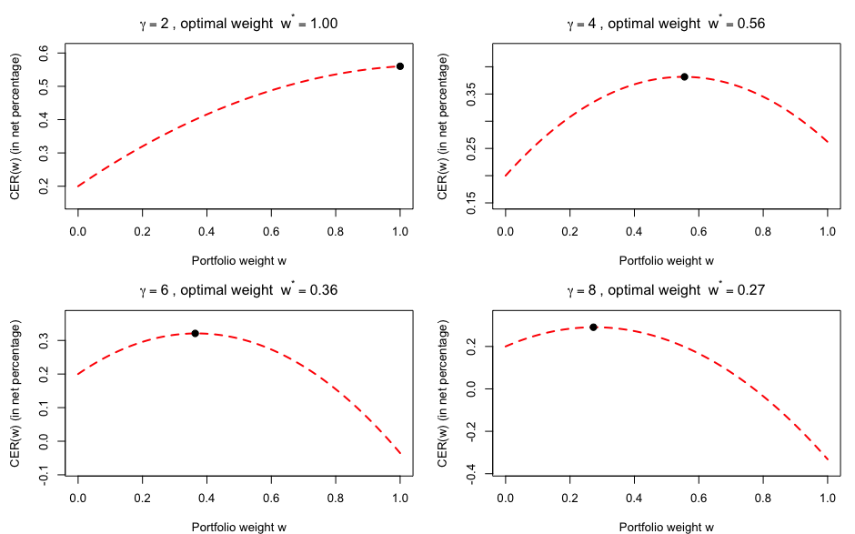

A Bayesian approach to portfolio choice, optimizing allocation between a risk-free asset and the S&P 500 (SPY) for an investor with Constant Relative Risk Aversion (CRRA) preferences.

## 📖 Overview

This project implements a Bayesian framework to determine the optimal portfolio weight ($w^*$) for a risk-averse investor. By combining prior beliefs with historical market data (SPY 2018-2022), we generate a **Posterior Predictive Distribution** for future returns and use **Monte Carlo simulation** to maximize the Certainty Equivalent Return (CER).

### Key Concepts
* **Asset Allocation:** Risk-Free Rate vs. SPY ETF.
* **Bayesian Inference:** Updating Normal priors with Normal likelihoods (conjugate pairs).
* **Utility Theory:** CRRA (Constant Relative Risk Aversion) Utility.
* **Numerical Optimization:** Monte Carlo simulation to solve integrals that cannot be evaluated analytically.

---

## 📊 The Theory

### 1. The Model
The log excess returns are assumed to follow a Normal distribution:
$$r_t = \log(R_t) - \log(R_f) \sim \mathcal{N}(\mu, \tau^{-1})$$

### 2. Bayesian Update
We assume the precision $\tau$ is known. The investor holds a prior belief about the mean return $\mu \sim \mathcal{N}(\mu_0, (\tau_0)^{-1})$. After observing data sample size $N$, the posterior distribution for $\mu$ is updated:

$$\mu_N = \frac{\tau_0 \mu_0 + \tau N \bar{r}}{\tau_0 + \tau N}$$

### 3. Predictive Distribution
The predictive distribution for the next period's return $r_{T+1}$ incorporates both the uncertainty in the data and the uncertainty in the parameter estimation:

$$r_{T+1} \sim \mathcal{N}\left(\mu_N, \frac{1}{\tau} + \frac{1}{\tau_N}\right)$$

### 4. Optimization Problem
The investor maximizes Expected Utility. For CRRA preferences, we maximize the **Certainty Equivalent Return (CER)**:

$$\text{Maximize } CER(w) = R_f \left( E\left[ (w e^{r_{T+1}} + (1-w))^{1-\gamma} \right] \right)^{\frac{1}{1-\gamma}}$$

Where:
* $w$: Weight in the risky asset (SPY)
* $\gamma$: Coefficient of relative risk aversion

---

## ⚡ Simulation Technique: Antithetic Variates

To improve the precision of the Monte Carlo simulation without increasing computational cost, this project employs the **Antithetic Variates** method.

### Why use it?
Standard "Crude" Monte Carlo simulations rely on purely random sampling, which can introduce significant variance (noise) unless $J$ is extremely large. Antithetic Variates introduces a negative correlation between samples, which reduces the variance of the estimator, resulting in smoother optimization curves.

### How it works
Instead of generating $J$ independent draws, we generate $J/2$ draws ($r_{half}$) and create their symmetric opposites reflected across the predictive mean ($\mu_N$).

The reflection formula used is derived from the symmetry of the Normal distribution:
$$r_{anti} = 2\mu_N - r_{half}$$

1. We draw a sample $r$.
2. We calculate its "mirror image" relative to the mean. If $r$ is a specific distance *above* the mean, $r_{anti}$ is that exact distance *below* the mean.
3. This ensures the sample mean of our simulation is exactly equal to the theoretical mean $\mu_N$, eliminating a major source of sampling error.

---

## 🖼️ Results

The analysis calculates the optimal weights for different levels of risk aversion ($\gamma \in \{2, 4, 6, 8\}$).



### Observations
* **Inverse Relationship:** As risk aversion ($\gamma$) increases, the optimal allocation to SPY ($w^*$) decreases significantly.
* **Convexity:** The utility function (and CER) is concave, allowing for a distinct global maximum.

| Risk Aversion ($\gamma$) | Optimal Weight ($w^*$) | Interpretation |
| :---: | :---: | :--- |
| **2** | ~1.00 | Aggressive investor; fully invested in Equities. |
| **4** | ~0.56 | Balanced investor. |
| **6** | ~0.37 | Conservative investor. |
| **8** | ~0.28 | Highly risk-averse; mostly Cash/Bonds. |

---

## 🛠️ Installation & Usage

### Prerequisites
You need **R** installed. The script uses the following libraries:
* `quantmod` (for fetching SPY data)
* `base` graphics (no extra installation required for plotting)

### Running the Code
1. Clone the repository:
   ```bash
   git clone [https://github.com/yourusername/bayesian-portfolio-choice.git](https://github.com/yourusername/bayesian-portfolio-choice.git)